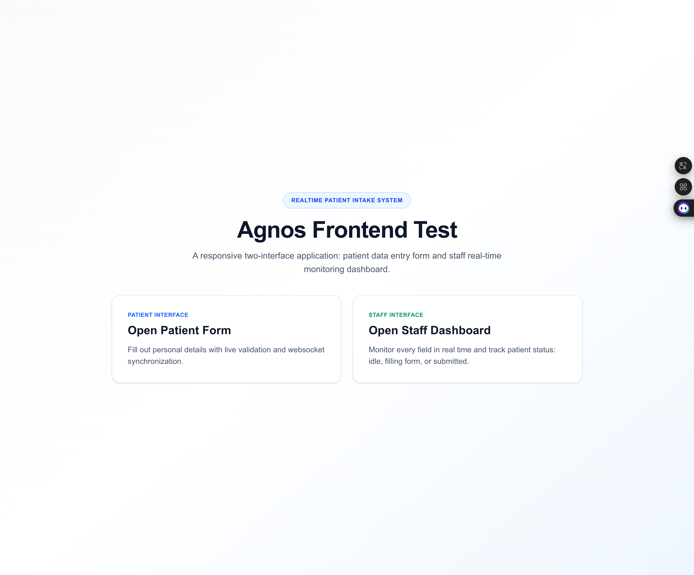
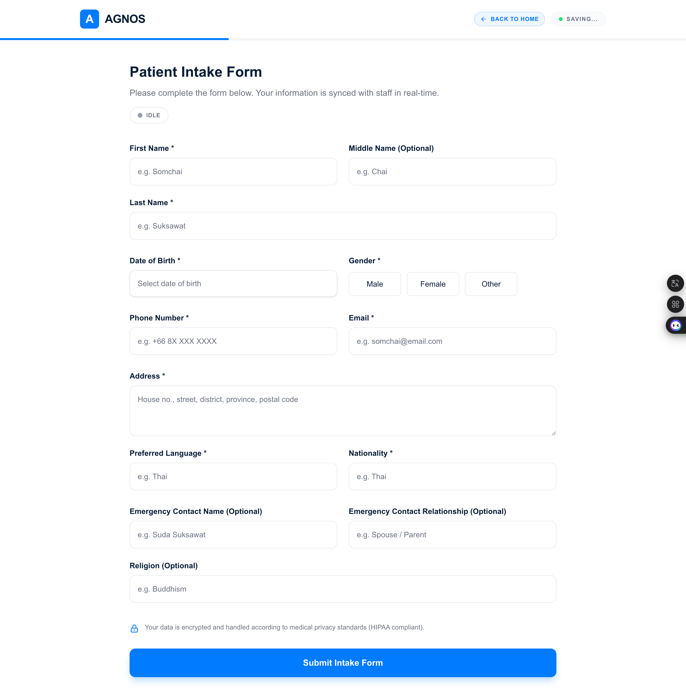
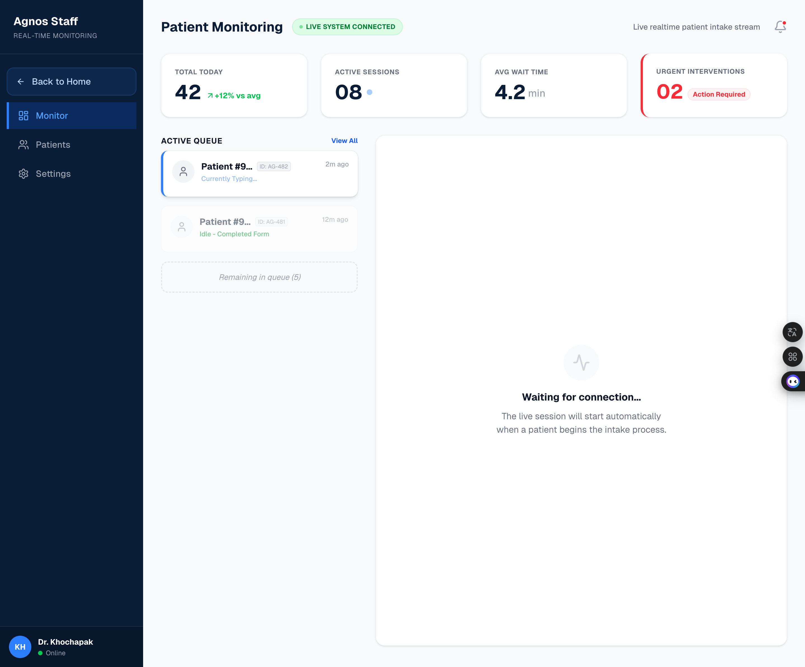
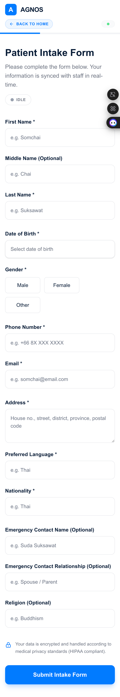
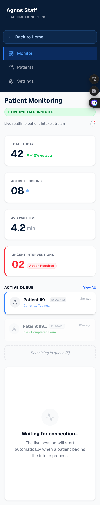

# Agnos Realtime Patient Intake

Realtime patient intake form with a synchronized staff monitoring dashboard.

## ภาษาไทย (สรุปอ่านง่าย)

โปรเจกต์นี้คือระบบฟอร์มคนไข้ที่เชื่อมกับหน้าจอเจ้าหน้าที่แบบเรียลไทม์

- ฝั่งคนไข้ (`/patient`)
  - กรอกข้อมูลประวัติคนไข้ได้ครบ
  - มี validation ตรวจข้อมูลด้วย Zod
  - ไม่โชว์ error สีแดงทันทีตอนเปิดหน้า
  - จะโชว์ error เมื่อผู้ใช้แตะ/ออกจากช่องนั้น หรือกด Submit
- ฝั่งเจ้าหน้าที่ (`/staff`)
  - เห็นข้อมูลที่คนไข้กำลังกรอกแบบเรียลไทม์
  - เห็นสถานะ `Idle`, `Filling form`, `Submitted`
- Realtime
  - ใช้ Socket.IO ผ่าน custom server (`server.js`)
  - `patient:update` ส่งเฉพาะห้อง `staff`

### วิธีรันแบบสั้นๆ

```bash
npm install
npm run dev
```

เปิดใช้งานที่:

- `http://localhost:3000/patient`
- `http://localhost:3000/staff`

## Screenshots

### Desktop

### Landing Page



### Patient Page



### Staff Page



### Mobile

<p align="center">
  
  
  
</p>

## Tech Stack

- **Framework:** Next.js 16 (App Router)
- **Styling:** Tailwind CSS v4
- **Realtime Communication:** Socket.IO (WebSocket transport via custom Node server)

## Core Features

### 1) Patient Form (`/patient`)

- Collects all required intake fields:
  - First name, middle name (optional), last name
  - Date of birth, gender
  - Phone, email, address
  - Preferred language, nationality
  - Emergency contact (optional: name + relationship)
  - Religion (optional)
- Realtime validation using **Zod**
- Inline field-level errors
- Hybrid validation UX:
  - No red errors on first page load
  - Show field error after user touches/leaves a field
  - Show all remaining errors when user presses submit
- Live form state indicator:
  - `Idle`
  - `Filling form`
  - `Submitted`
- Fully responsive for mobile and desktop

### 2) Staff Dashboard (`/staff`)

- Receives and renders each patient field in realtime
- Displays live status badge:
  - `Idle`
  - `Filling form`
  - `Submitted`
- Shows last updated timestamp and derived age from date of birth
- Responsive layout for smaller and larger screens

### 3) Realtime Synchronization

Socket events used:

- `patient:update` → broadcast latest partial/full form payload to `staff` room only
- `patient:status` → broadcast patient state (`idle`, `typing`, `submitted`) to connected clients
- `patient:submit` → broadcast submitted payload snapshot to connected clients

## Run Locally

```bash
npm install
npm run dev
```

Then open:

- `http://localhost:3000` (landing)
- `http://localhost:3000/patient`
- `http://localhost:3000/staff`

## Quality Checks

```bash
npm run lint
```

## Deployment

This project uses a custom `server.js` for Next.js + Socket.IO.

### Free Deploy (Render) — Quick Start

1. Push this project to GitHub.
2. In Render, create a **Web Service** from your repository.
3. Set service config:
   - Build Command: `npm install && npm run build`
   - Start Command: `npm run start`
   - Environment: `NODE_VERSION=20`, `NODE_ENV=production`
4. Deploy and open:
   - `/patient` for patient form
   - `/staff` for realtime staff dashboard

## Deliverables Checklist

- [ ] Repository URL: `https://github.com/yongyut-wil/agnos-frontend-test`
- [ ] Live URL: `https://agnos-frontend-test.onrender.com/`
- [x] README with setup + feature details
